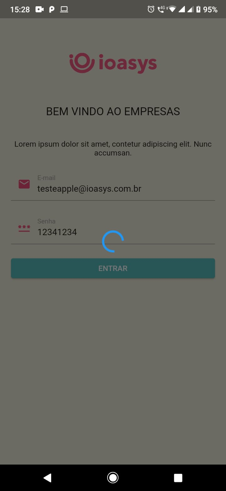
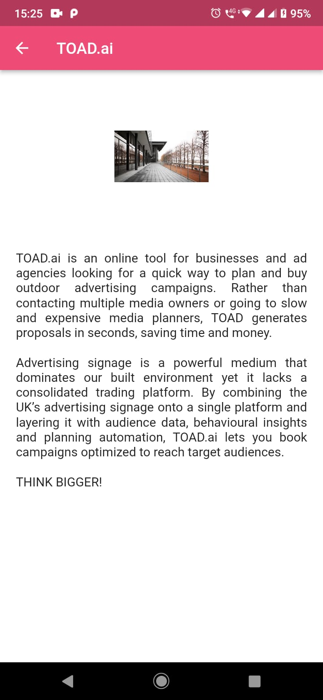

App do desafio da empresa ioasys (https://bitbucket.org/ioasys/empresas-android/src/master/).
Composto por 3 telas:

1. Tela login:
   Para fazer login no aplicativo utilize o email: testeapple@ioasys.com.br e senha: 12341234;

2. Tela de listagem das empresas:
   Nessa tela foi feita uma requisição para obter a lista de empresas e utilizado uma endpoint para
   filtrar a mesma. Foram utilizados os headers obtidos da tela anterior para autenticar essa
   requisição (access-token, uid, client);

3. Tela de descrição de uma empresa:
   Nessa tela são exibidos em detalhe as informações de uma empresa clicada na lista da tela
   anterior. Foi utilizada a biblioteca Hive para salvar no cache a empresa clicada mostrada nessa
   tela.

##

         